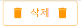

### React Icons

<a>https://react-icons.github.io/react-icons/

> npm install react-icons --save

```js
import { MdDelete } from "react-icons/md";

function Question() {
  return (
    <Button startIcon={<MdDelete />} endIcon={<MdDelete />}>
      삭제
    </Button>
  );
}
```


