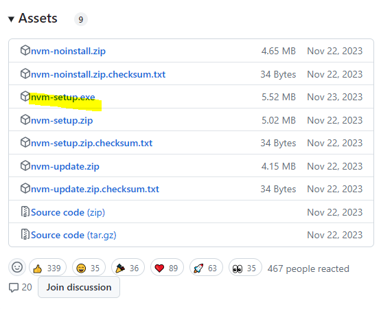
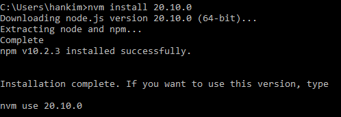
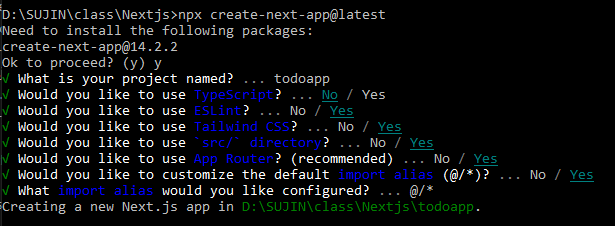
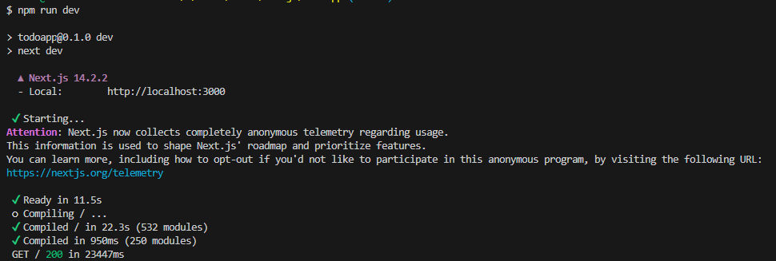
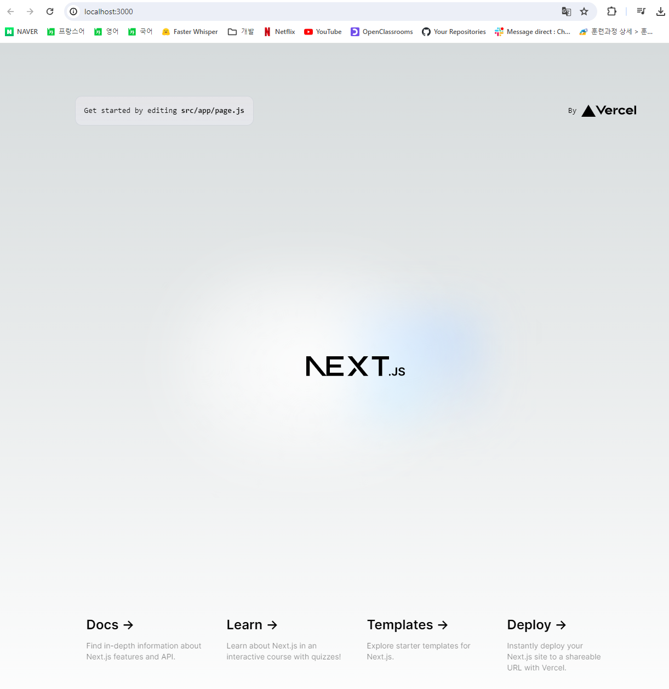
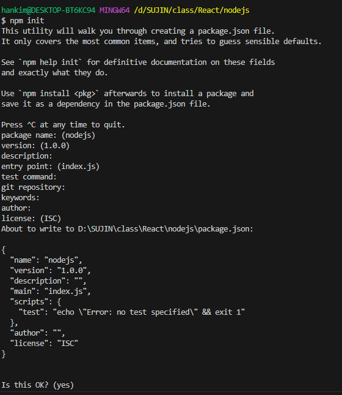
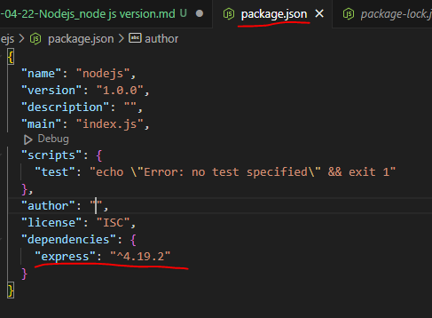
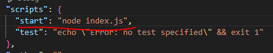

1. Enter the site <a> https://github.com/coreybutler/nvm-windows/releases - click 'nvm-setup.exe' - install

   

1. Enter 'nvm install ‘desired version’' in the cmd command prompt

   

1. Enter 'nvm use 20.10.0'

1. Install node js

   > npx create-next-app@latest
   > 

1. Enter 'npm run dev' in VS code terminal
   

> click 'http://localhost:3000' + ctrl



5-1. Enter 'npm install' before entering 'npm run dev' when starting from a new folder

## When Node.js is already installed

1. in termial

   > mkdir "folder name"
   > cd "folder name"
   > npm init

   

   => created 'package.json'

2. create 'index.js'

## Install Express.js

3. install express.js

   > npm install express --save
   > 

4. create'app.js' and copy this

   ```js
   const express = require("express");

   const app = express();

   app.use((req, res) => {
     res.json({ message: "votre requete a bien ete recue" });
   });

   module.exports = app;
   ```

5. copy in 'server.js'

   ```js
   const http = require("http");
   const app = require("./app");

   app.set("port", process.env.PORT || 3000);
   const server = http.createServer(app);

   server.listen(process.env.PORT || 3000);
   ```

6. add 'start: node index.js' in package.json



6. in terminal
   > npm run start
